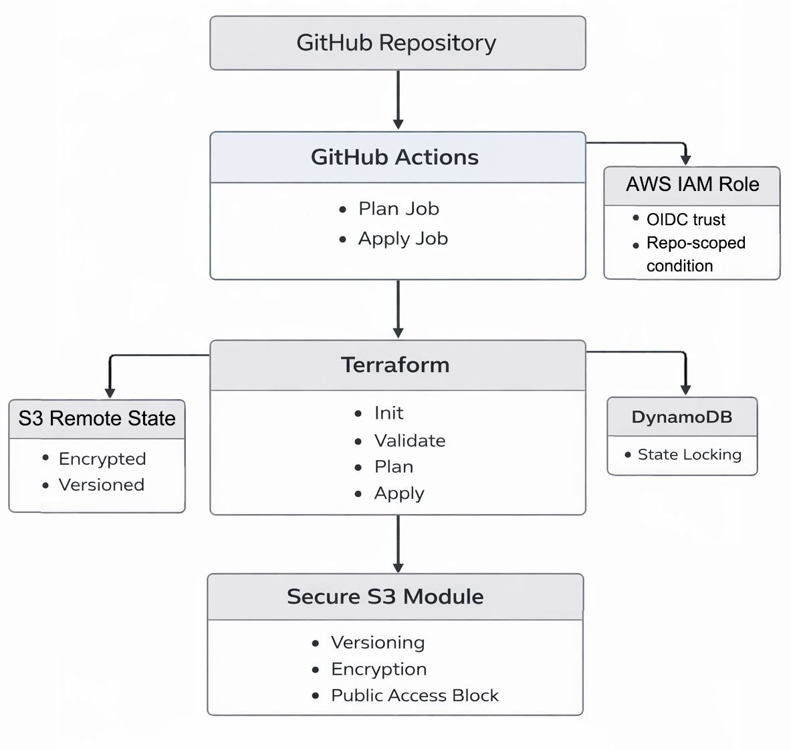

# AWS Secure CI/CD Terraform Pipeline

Production-oriented CI/CD foundation for securely delivering Terraform-managed AWS infrastructure using GitHub Actions and OIDC federation.

---

## Overview

This repository demonstrates a secure infrastructure delivery pipeline built with:

- GitHub Actions
- OpenID Connect (OIDC) federation to AWS
- Terraform (modular structure)
- Remote encrypted state (S3 + DynamoDB locking)
- Checkov static security scanning
- Plan/Apply separation with manual approval

No static AWS credentials are used.

---

## Architecture Design

GitHub → GitHub Actions → OIDC → AWS IAM Role  
→ Terraform Init/Validate  
→ Checkov Scan  
→ Terraform Plan (artifact)  
→ Manual Approval (environment gate)  
→ Terraform Apply

---

## Security Model

- OIDC federation (no access keys)
- Repository-scoped IAM trust policy
- Encrypted remote state backend
- DynamoDB state locking
- Artifact-based promotion (plan → apply)
- Manual production approval gate
- Static IaC security scanning enforced

---

## Pipeline Stages

**Plan Job**
- Format check
- Terraform init
- Validate
- Checkov scan (blocking)
- Plan generation
- Plan artifact upload

**Apply Job**
- Requires manual approval
- Downloads plan artifact
- Assumes AWS role via OIDC
- Applies approved plan

---

## Identity & Federation

GitHub Actions authenticates to AWS using:

- `sts:AssumeRoleWithWebIdentity`
- Repository-scoped `sub` condition
- Short-lived credentials

No IAM users or long-lived secrets.

---

## State Management

- Remote S3 backend
- Encryption enabled
- Versioning enabled
- DynamoDB locking for concurrency protection

---

## Deployment Controls

- Environment-based approval (`production`)
- Apply restricted to `main` branch
- Plan artifact required for apply

---

## Purpose

This repository demonstrates secure infrastructure delivery patterns aligned with modern DevSecOps and platform engineering practices.
